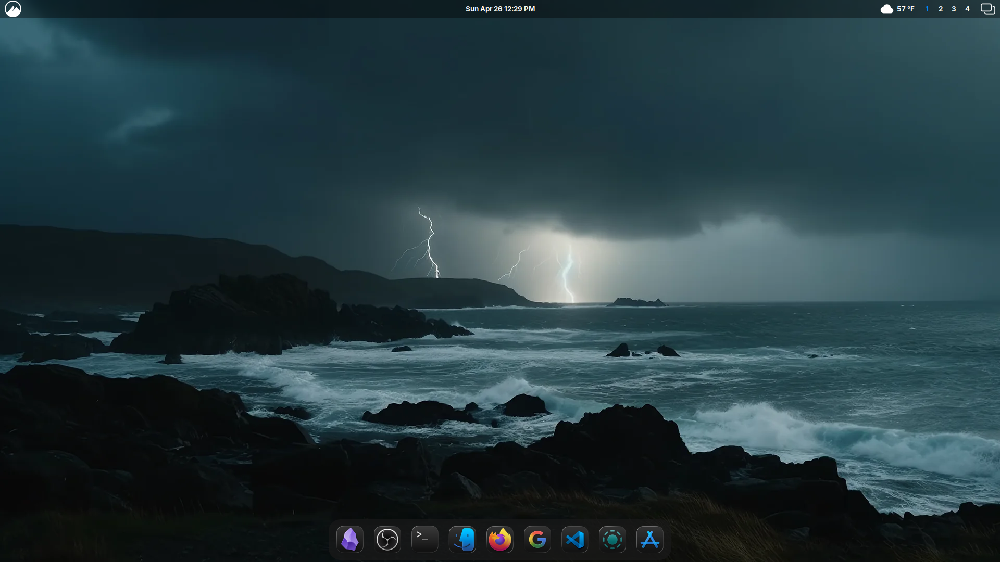

# macOS Tahoe Rice - Cinnamon
A clean, performance-focused macOS clone for Cinnamon.

### Hardware
- **CPU:** Intel i5-9400
- **GPU:** Intel UHD 630
- **RAM:** 8GB DDR4

### Visuals
- **GTK Theme:** MacTahoe-Dark
- **Cursor:** MacTahoe-cursors
- **Icons:** MacTahoe-Dark (Custom icons in custom-icons)
- **Dock:** Plank (Locked config)
- **Terminal:** Blackbox
- **Shell:** Zsh (Powerlevel10k)

### Config

#### 1. Custom Icons
The icons in the `custom-icons` folder have been manually processed with ImageMagick (`-trim -resize 110%`) to ensure they are not too big or small on plank.
* **To Install:** Copy the `custom-icons` folder to `~/.icons/`.
* **To Apply:** Use a Menu Editor (like MenuLibre) to manually set your app icons to these images via the app's properties.

* #### 2. Plank Dock Configuration
To get the exact look:
* Copy the `settings` file to `~/.config/plank/dock1/`.
* Copy the WhiteSur-Dark folder to ~/.local/share/plank/themes/ and apply in preferences.
* (You should use plank-reloaded since plank isn't getting updates anymore.)
  
#### 3. Terminal & Shell
* Copy `.zshrc` and `.p10k.zsh` to your `$HOME` directory.

## How to add your own custom icons

A common issue i see with macOS icons for linux is that they do not apply dark mode to most icons, even in dark mode (For instance; WhiteSur and MacTahoe by vinceluice) so, this is how you can add custom icons.

### 1. Find your source
Go to [macOSicons.com](https://macosicons.com/) and search for your app. 
* Download the `.icns` file.

### 2. The Conversion
Don't just rename the file, you need to extract the high-quality layer and fix the scaling so it isn't "huge" or "tiny" in your dock.

Run these in your terminal (replace `YourApp` with the name of the file):

1. **Extract the image:**
   `icns2png -x -s 512x512 ~/Downloads/YourApp.icns`

2. **Standardize the size:**
   Most icons from the web have weird borders. This command trims the "invisible" edges and resizes it to 110% so it lines up with other apps:
   `convert ~/YourApp_512x512x32.png -trim -resize 110% ~/.icons/custom-tahoe/YourApp.png`

3. **Size Fix:**
   If the icon looks too big once you pin it to Plank, run this to shrink it (or make the resize and border higher if its too small)
   `convert ~/.icons/custom-tahoe/YourApp.png -resize 90% -bordercolor none -border 4% ~/.icons/custom-tahoe/YourApp.png`

### 3. Apply it
Open your **Menu Editor**, find the app, go to its properties, click the icon, and browse to your `~/.icons/custom-tahoe/` folder. Unpin the app, close it, and pin it again, then restart Plank (`killall plank && plank`) and you're done.

### Extras

- **My Fonts**

- **My Applets**
The applets from left to right are: Menu, Calendar, Weather, Workspace switcher, and Windows quick list.

**Date Format**
The date format is "%a %b %-d %-I:%M %p".
